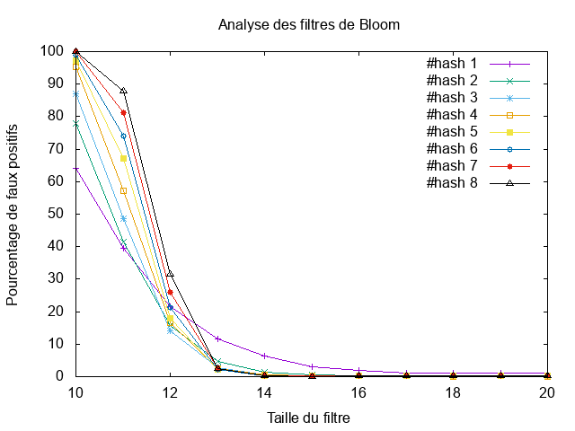

---------------
 tp-bloom
---------------

.. toctree::
   :maxdepth: 1

   bloomfilter.rst

~~~~~~~~~~
Etat du TP
~~~~~~~~~~

R.A.S

~~~~~~~~~~~~~~~~~~~~~~
Réponses aux questions
~~~~~~~~~~~~~~~~~~~~~~

Question 2.4.2.3
----------------

Un exemple effectué avec un filtre de Bloom de taille :math:`2^1` soit de taille
:math:`2` nous montre qu'on peut avoir un faux positif.

Question 2.4.3.4
----------------

Ces courbes nous montrent qu'avec un filtre de Bloom de petite taille. Il est plus intéréssant,
d'utiliser une fonction de hachage car le nombre de faux positifs s'approche des 60% ce qui reste
conséquent mais pas autant que l'utilisation de 5 ou plus fonctions de hachage où la, le taux atteint
presque les 100%.

A partir d'un filtre de Bloom de taille 2^13, l'utilisation d'une seul fonction de hachage devient la solution la moins intéréssante.
2 ou plusieurs fonctions de hachage ramène le taux de faux positifs à environ 5% tandis que l'utilisation d'une seul
fonction, le taux lui est à 12%.

On constate aussi que plus la taille du filtre est grande plus le taux de faux positifs tend vers 0% et ceci pour n'importe quel
nombre de fonctions de hachage.
