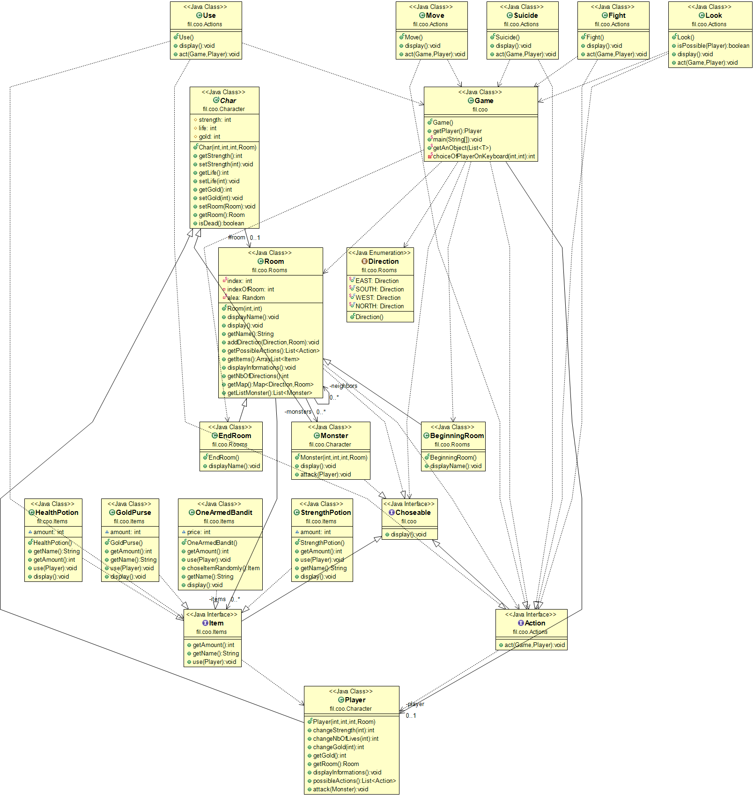

Projet DONJON
===================

DESMAREST Mathilde / SYLLEBRANQUE Pierre
COO GROUPE 6

-------------
Introduction
-------------

Voici notre jeu donjon.

Le jeu fonctionne ainsi :
 - On crée à chaque fois un donjon avec plusieurs pièces, chaque pièce contient un nombre de monstres et d'items.
 - Les pièces sont reliées entre elles.
 - Le but du joueur est de sortir du donjon.
 - Pour sortir du donjon, il parcourt les pièces, les items l'aident à acquérir de la force, de la vitalité, ou de l'argent et les monstres empechent le joueur de continuer son chemin car il doit les tuer pour avancer.

How to
-------------
> **Récupération du dépot : **
git pull

> **Pour générer la documentation : **
mvn package
puis
mvn javadoc:javadoc
  : La documentation se trouve ensuite dans target/docs

> **Pour générer le projet: **
mvn package

> **Pour éxécuter : **
java -jar target/Donjon-1.0-SNAPSHOT.jar

> **Fonctionnement global du projet : **
A chaque "tour", le joueur doit choisir un chiffre par rapport au menu qui s'affiche. Cela peut être une action (regarder, utiliser un objet, attaquer un monstre, se déplacer), choisir une salle, choisir quel objet/monstre il veut utiliser.
Trois solutions pour mettre fin au jeu : le joueur arrête le jeu par lui-même, le joueur est tué par un monstre, ou le joueur a trouvé la sortie et a gagné !

> **UML : **
L'uml se note Donjon.png, on peut y retrouver toutes les classes et les liens entre les différentes classes.

> **La classe Choseable **
Cette classe nous permet de choisir un objet dans une liste soit de monstres, d'actions, de salles ou d'items. Nous avons utilisés les génériques pour cela.

> **Plus**
Les tests ont été faits (certains avec des mocks)
