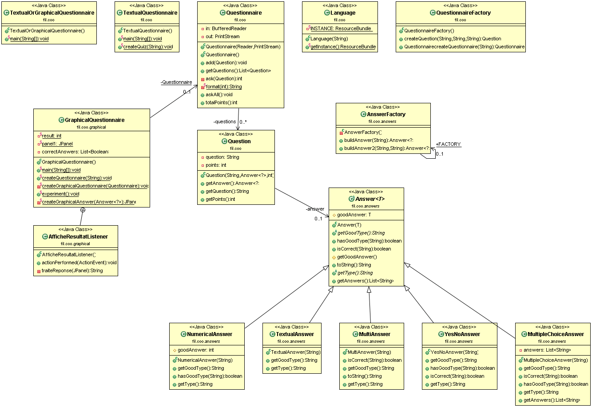

Projet QUESTIONNAIRE
===================

Pierre SYLLEBRANQUE / Mathilde DESMAREST
COO GROUPE 6

----------

Introduction
-------------

Voici notre projet Questionnaire qui permet de créer des quiz à partir de fichiers textes et de jouer soit en mode texte ou en mode graphique.

How to
-------------
> **Récupération du dépot : **
git pull

> **Pour générer le projet: **
mvn package

> **Pour générer la documentation : **
mvn javadoc:javadoc  
> La documentation se trouve ensuite dans target/docs

> **Pour éxécuter : **
java -jar target/Questionnaire-1.0-SNAPSHOT.jar nomFichier modeDeJeu langue
nomFichier étant le nom du quiz et pouvant être quiz_Tolkien.txt, quiz_Totally_Spies.txt
modeDeJeu permet de jouer en mode texte ou graphique (textual/graphical)  
langue permet de choisir si on souhaite jouer en francais ou en anglais (fr/en)
par exemple : java -jar target/Questionnaire-1.0-SNAPSHOT.jar quiz_Tolkien.txt graphical fr

> **Fonctionnement global du projet : **  
Dans ce projet, un quiz est composé de questions et réponses qui rapportent des points (un nombre différent selon les questions).
Il y a plusieurs type des questions possibles: celles avec des réponses nécessitant une donnée numérique (NumericalAnswer), celles nécessitant un texte (TextualAnswer), celles où il faut choisir la réponse parmi plusieurs choix donnés (MultipleChoiceAnswer), celles où il y a plusieurs réponses différentes possibles (MultiAnswer), pour finir il y a celle où il faut répondre par oui ou par non (YesNoAnswer).
2 questionnaires différents sont possibles dans notre projet, quiz_tolkien et quiz_Totally_Spies. Bon jeu!

> **UML : **
L'uml se note UML.git, on peut y retrouver toutes les classes et les liens entre les différentes classes.

