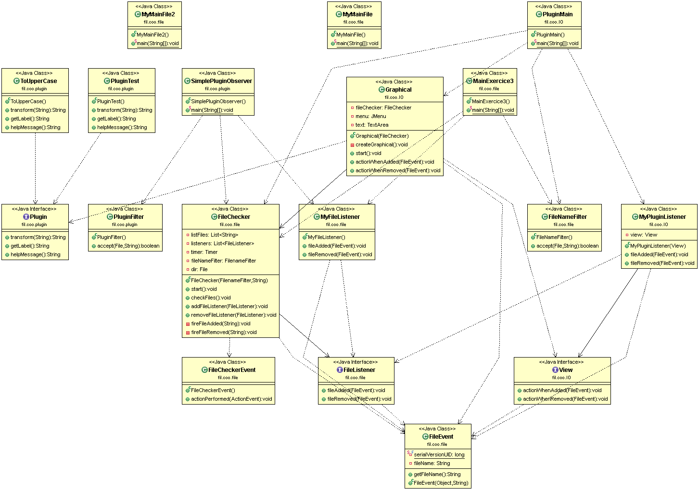

Projet Plugin
===================

SYLLEBRANQUE Pierre / DESMAREST Mathilde
COO GROUPE 

----------

Introduction
-------------

Voici notre projet Plugin qui permet de créer une application graphique à laquelle on peut ajouter des plugins de traitement de texte

How to
-------------
> **Récupération du dépot : **
git pull

> **Pour générer le projet: **
mvn package

> **Pour générer la documentation : **
mvn javadoc:javadoc  
> La documentation se trouve ensuite dans target/docs

> **Pour éxécuter : **
java -jar target/plugin-1.0-SNAPSHOT.jar

> **Fonctionnement global du projet : **  

Ce projet est une application du design pattern observer.
Quand un nouveau fichier est détecté, alors la classe qui détecte "prévient" les listeners de cet événement; idem quand un fichier est supprimé.
Pour ce projet, on ajoute un item au menu de l'application graphique, et un clique sur cet item provoque le changement du texte.
Par défaut, tout les plugins que nous avons déjà créé ont été mis dans le dossier extensions afin de pouvoir les tester directement en méthode graphique.

Pour que le .jar fonctionne, il faut créer un dossier 'extensions' à la racine du projet et y mettre tout les plugins en '.class'. Ici, 'PluginTest.class' 'PluginVacances.class' 'ToUpperCase.class'

> **Réponses aux questions : **

Exercice 1 : Les timers
Fait dans le package timer.  
Se lance avec java -classpath target/classes fil.coo.timer.MyMainTimer

Exercice 2 : Lister le contenu d'un répertoire
Pour retourner la liste des fichiers qui commencent par un C : le main est MyMainFile2 : se lance avec java -classpath target/classes fil.coo.file.MyMainFile2
Pour retourner la liste des fichiers qui finissent par un .class : le main est est MyMainFile : se lance avec java -classpath target/classes fil.coo.file.MyMainFile
(Il faut auparavant ajouter des fichiers commençant par un C ou terminant par .class, car initialement il n'y a pas de tels fichiers).

Exercice 3 : Un vérificateur de nouveaux fichiers .class
Ici, on détecte quand un .class est ajouté ou supprimé et on l'écrit sur la sortie standard.
Pour exécuter on lance le main MainExercice3.
Se lance avec java -classpath target/classes fil.coo.file.MainExercice3
(pour tester il faut ajouter un .class a la racine du projet)

Exercice 4/Exercice 5 : Le projet décrit plus haut.
En version non graphique, on lance avec java -classpath target/classes fil.coo.plugin.SimplePluginObserver

Le reste est dans le package IO et Plugin, c'est le "vrai" projet, expliqué ci-dessus.
> **UML : **
L'uml se note UML.gif, on peut y retrouver toutes les classes et les liens entre les différentes classes.

